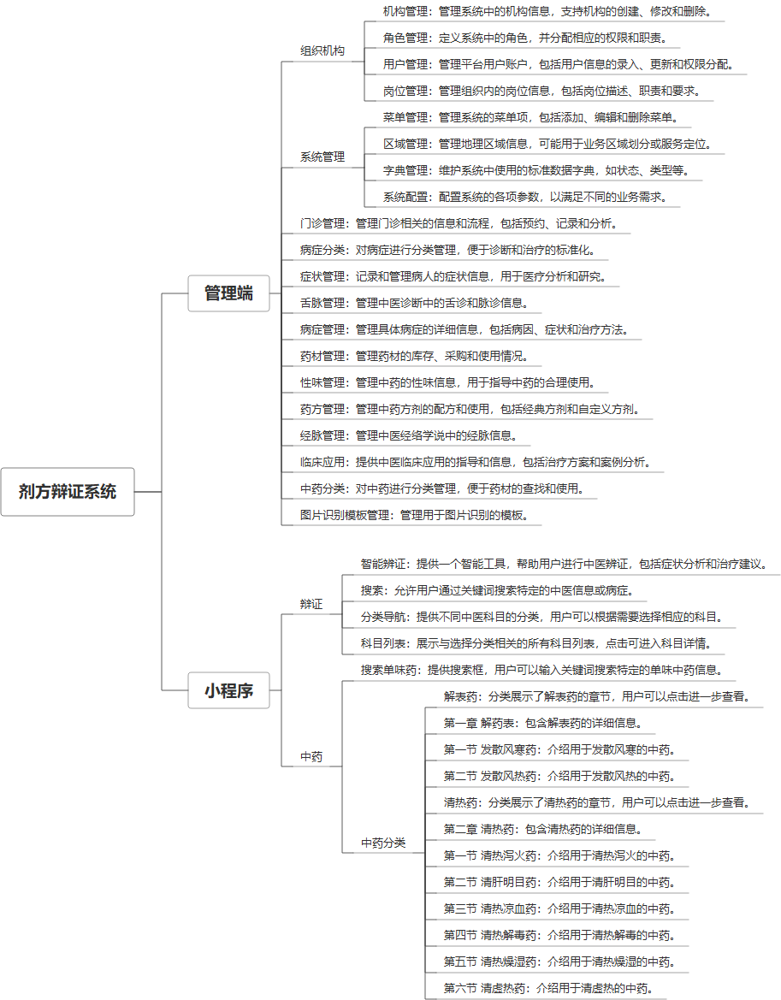

 

    
 

公司拥有上百套具有自主知识产权的软件系统，详情请查看码云首页或公司官网

 
<h1>剂方辩证系统</h1>

<a href="https://www.haishi.net.cn/">公司官网</a> ｜ <a href="https://www.haishi.net.cn/">在线体验</a>

 

## 系统介绍

"剂方辩证系统"是一款集成门诊管理、病症与症状分类、中药及药材管理、舌脉与经脉分析、药方配伍、性味归经、临床应用指导及图片识别等功能的综合性医疗软件，通过WEB端和小程序端为中医师提供便捷的诊断和治疗辅助工具，助力提升诊疗效率与准确性。
"剂方辩证系统"是一款集成门诊管理、病症与症状分类、中药及药材管理、舌脉与经脉分析、药方配伍、性味归经、临床应用指导及图片识别等功能的综合性医疗软件，通过WEB端和小程序端为中医师提供便捷的诊断和治疗辅助工具，助力提升诊疗效率与准确性。
本项目名称为剂方辩证系统，是一款中医辅助诊疗系统，旨在帮助中医医生进行辩证论治，开具药方。系统涵盖了中医诊疗的各个环节，包括病症分类、病状管理、舌脉管理、病症管理、药材管理、性味管理、药方管理、经脉管理、临床应用、中药分类以及图片识别模板管理等功能模块。该系统通过对患者的症状、舌脉等信息进行综合分析，结合中医理论知识，辅助医生进行辩证，并提供相应的药方参考，提高诊疗效率和准确性。
本项目目前展现的功能涵盖了PC端管理后台，具体的功能模块如下：
- 系统管理端：涵盖了系统配置、菜单管理、区域管理、字典管理、机构管理、角色管理、用户管理和岗位管理等功能，用于维护系统基础数据和用户权限。
- 诊疗管理端：包含了病症分类、病状管理、舌脉管理、病症管理、药材管理、性味管理、药方管理、经脉管理、临床应用、中药分类以及图片识别模板管理等功能，用于中医医生进行辩证论治和药方管理。
                

## 系统功能介绍

### 系统包含终端说明

管理端（WEB）、用户端（微信小程序）

| 序号 | 模块 | 模块说明 |
| --- | --- | --- |
| 1 | YL-ZYBZ-GL-MANAGE | 管理端 |
| 2 | YL-ZYBZ-GL-SERVER | 服务端 |
| 3 | YL-ZYBZ-GL-MP | 小程序 |

### 系统功能结构

### 系统功能说明

系统管理：
- 菜单管理：管理系统菜单，控制用户权限。
- 区域管理：管理区域信息，例如省市区等。
- 字典管理：管理系统中的字典数据，例如疾病类型、药材种类等。
- 系统配置：配置系统参数，例如系统名称、版本号等。
- 机构管理：管理医疗机构信息。
- 角色管理：管理用户角色，分配不同权限。
- 用户管理：管理用户信息，例如医生、管理员等。
- 岗位管理：管理不同岗位的职责和权限。
诊疗管理：
- 病症分类：对病症进行分类管理，方便查询和统计。
- 病状管理：管理各种病状信息，例如发热、咳嗽等。
- 舌脉管理：管理舌脉信息，例如舌苔颜色、脉象等。
- 病症管理：管理各种病症信息，例如感冒、咳嗽等。
- 药材管理：管理药材信息，例如药材名称、功效等。
- 性味管理：管理药材的性味信息，例如寒热温凉等。
- 药方管理：管理药方信息，例如药方组成、剂量等。
- 经脉管理：管理经脉信息，例如十二经脉、奇经八脉等。
- 临床应用：记录临床应用案例，供医生参考。
- 中药分类：对中药进行分类管理，方便查询和统计。
- 图片识别模板管理：管理图片识别模板，例如舌苔图片识别、脉象图片识别等。

## 系统主要界面

## 系统技术说明

### 代码模块说明

| 序号 | 目录 | 目录说明 |
| --- | --- | --- |
| 1 | YL-ZYBZ-GL-SERVER/zybz-module | -- |
| 2 | YL-ZYBZ-GL-SERVER/zybz-plugins | -- |
| 3 | YL-ZYBZ-GL-SERVER/zybz-web | -- |
| 4 | YL-ZYBZ-GL-SERVER/zybz-platform | -- |

### 系统技术选型

#### 开发语言/框架

JAVA（JDK1.8）
脚手架：JEEPLUS
框架：SpringBoot2.x
系统结构：单体应用
前端框架：VUE2

#### 服务中间件

Tomcat

#### 数据库

MySQL（5.7+）
Redis

#### 其他说明

无

## 系统演示/商用

请扫码添加客服微信获取演示地址和系统详细资料。

如果您想基于剂方辩证系统进行商业化交付或定制开发服务，我们提供有偿的技术服务支持，合作模式不限，欢迎沟通！

公司官网地址： <a href="https://www.haishi.net.cn/">https://www.haishi.net.cn</a>

联系客服获取专业回答。

## 使用须知

1、 本项目商用必须获得版权所有者的授权。

2、 未经允许本项目代码不允许二次出售。

